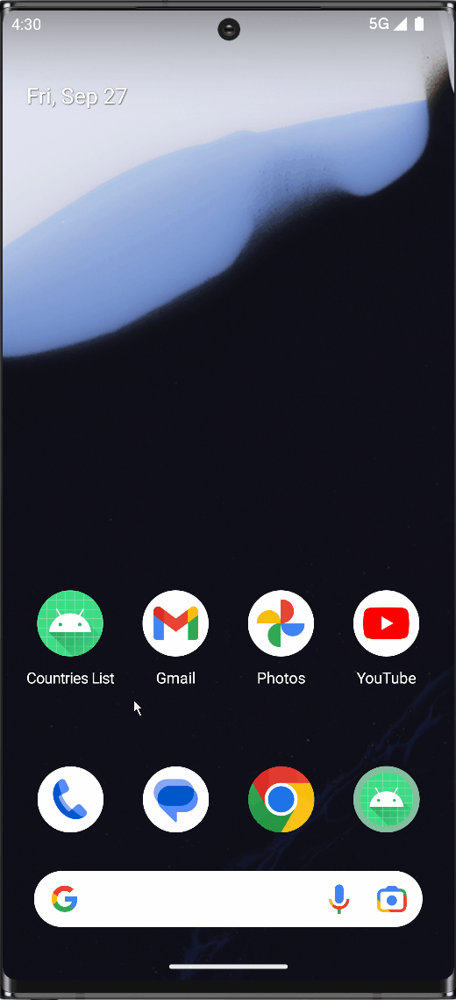

# Countries List #
An Android app which fetches a list of countries and shows it's USD exchange rate.

---

## **Download** ##
- Click [here](https://github.com/PrasoonDhaneshwar/CountriesList/releases/download/1.0.0/countries-list-1.0.0-debug.apk) to download the **CountriesList** application.

---

## 📸 Screenshots ##

  
  
  
  
  
  
  
  

---
## 🔑 APIs ##

*List of countries:*
<https://restcountries.com/v3.1/>

*Exchange rate:*
<https://www.exchangerate-api.com/>

---

## 🛠️ Libraries and Dependencies ##

- *[Retrofit](https://square.github.io/retrofit/)* - A type-safe HTTP client for Android & *[OkHttp](https://square.github.io/okhttp/)* to interpret responses and recover from common connection problems.
- *[Coil](https://coil-kt.github.io/coil/).* An image loading library for Android and Compose Multiplatform.
- *[Hilt](https://dagger.dev/hilt/)* - Provides a standard way to incorporate Dagger dependency injection into an Android application.
- *[mockk](https://mockk.io/)* - mocking library for Kotlin to cover unit tests.
- *[Material Components for Android](https://github.com/material-components/material-components-android)* - Modular and customizable Material Design UI components for Android.
